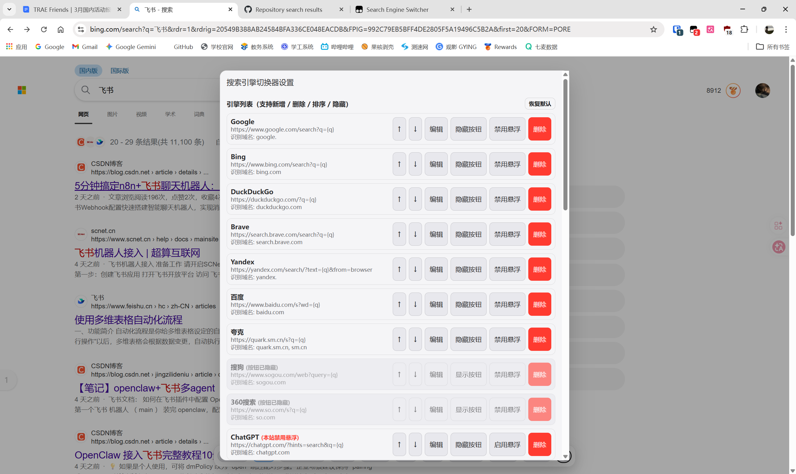
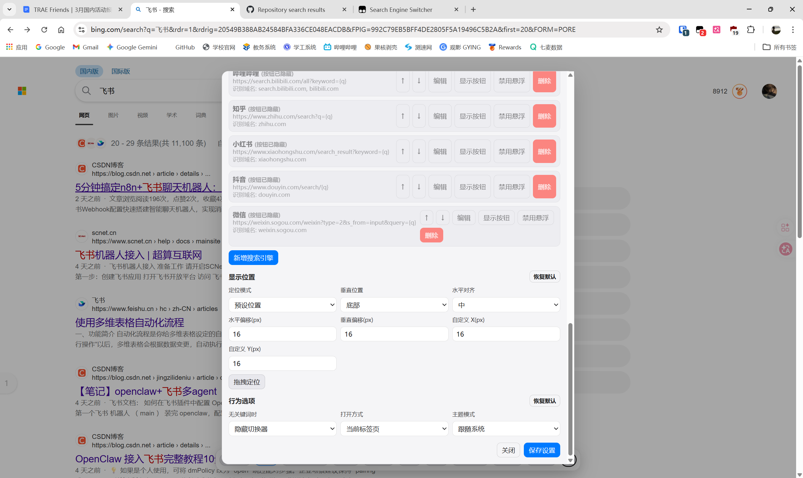

# Search Engine Switcher

一个快捷切换浏览器搜索引擎的油猴脚本，让你在任何网页都能快速切换搜索引擎。

## 界面展示





## 功能特性

- 快速切换搜索引擎，保留当前搜索词
- **自适应横向滚动**：当配置了大量搜索引擎时，悬浮窗不会变形。支持移动端手指滑动，支持**桌面端鼠标滚轮滚动**，右侧带有优雅的渐隐提示效果。
- 支持 22+ 个预设搜索引擎，包括：
  - **传统搜索引擎**：Google、Bing、百度、DuckDuckGo、Brave、Yandex、搜狗、夸克、360搜索
  - **AI 大模型**：ChatGPT、Perplexity、Gemini、通义千问、豆包、DeepSeek、Kimi、秘塔AI
  - **社交/社区**：YouTube、GitHub、哔哩哔哩、知乎、小红书、抖音、微信
- 自定义搜索引擎（添加/删除/排序/隐藏）
- **配置导入与导出**：支持将你的所有自定义搜索引擎和界面设置导出为 JSON 文件，并在不同设备或浏览器间导入同步。
- 悬浮控件位置自定义（预设位置或拖拽定位）
- **灵活的打开方式**：
  - 左键点击：根据设置在当前标签页或新标签页打开
  - **鼠标中键点击：强制在新标签页打开（原生浏览体验，防止触发自动滚动）**
- **智能的悬浮控件显示逻辑**：
  - 仅在配置了“识别域名”的搜索引擎页面显示
  - **支持单站点禁用**：如果你不希望在某些非传统搜索引擎（如 B站、YouTube 等视频或社交网站）中显示悬浮窗，可在设置中单独“禁用悬浮”
- 深浅色主题支持（跟随系统/浅色/深色）
- 新标签页/当前标签页打开方式切换
- 无关键词时显示/隐藏切换器

## 安装使用

### 1. 安装脚本管理器

首先需要在浏览器中安装一个用户脚本管理器：

- **Tampermonkey（推荐）**：<https://www.tampermonkey.net/>
- **Greasemonkey**（Firefox）：<https://addons.mozilla.org/firefox/addon/greasemonkey/>

### 2. 安装脚本

1. 点击 [Search-Engine-Switcher.js](./Search-Engine-Switcher.js) 文件
2. 点击 "Raw" 按钮获取原始代码
3. 脚本管理器会自动识别并提示安装，点击安装即可

### 3. 使用方法

#### 基本使用

- **显示条件**：悬浮控件**默认只会在搜索引擎的搜索结果页面显示**。如果在一个普通的网页（非搜索引擎）中，悬浮控件是不会出现的。对于像 B站、YouTube 这种社交类或视频类网站，如果在这些页面上显示悬浮窗会影响你的正常浏览体验，你可以进入设置面板，针对该网站点击“禁用悬浮”。
- **切换引擎**：
  - **左键点击** 搜索引擎名称即可切换到该引擎，自动携带当前搜索词。
  - **中键点击** 任意引擎，可以直接强制在**新标签页**中打开搜索结果。
- **打开设置**：长按悬浮控件或点击 ⚙ 按钮打开设置面板。

#### 设置面板

**引擎列表**

- 新增：添加自定义搜索引擎
- 导出/导入配置：将当前所有设置和搜索引擎列表导出为文件备份，或从文件恢复
- 删除：移除不需要的搜索引擎
- 排序：使用 ↑ ↓ 按钮调整顺序
- 显示按钮/隐藏按钮：控制该搜索引擎是否要在悬浮窗的**按钮列表**中展示出来
- 启用悬浮/禁用悬浮：**核心功能！** 决定是否要在这个搜索引擎自己的网页中注入并显示这个悬浮窗（如果你在 B站 发现一直有个悬浮窗很碍眼，请在这里将其“禁用悬浮”）
- 恢复默认：重置为预设搜索引擎列表

**显示位置**

- 定位模式：预设位置或自定义坐标
- 垂直位置：顶部或底部
- 水平对齐：左、中、右
- 水平/垂直偏移：微调位置
- 拖拽定位：直接在页面上拖拽悬浮控件
- 恢复默认：重置为默认位置

**行为选项**

- 无关键词时：是否在搜索框为空时显示切换器
- 打开方式：在新标签页或当前标签页打开搜索结果
- 主题模式：跟随系统、浅色或深色
- 恢复默认：重置为默认行为

#### 默认启用的搜索引擎

脚本默认启用以下 6 个搜索引擎：

1. Google
2. Bing
3. DuckDuckGo
4. Brave
5. Yandex
6. 百度

其他搜索引擎默认隐藏，可在设置中手动启用。

## 技术实现原理

### 核心架构

本脚本采用纯原生 JavaScript 实现，主要包含以下模块：

#### 1. 配置管理

- 使用 `GM_getValue` / `GM_setValue` 或 `localStorage` 持久化用户配置
- 支持配置合并和迁移，确保版本更新时用户设置不丢失
- 默认配置包含完整的搜索引擎列表和 UI 设置

#### 2. 搜索引擎检测

```javascript
function activeEngineIdByHost() {
  const host = location.hostname;
  return config.engines.find((e) =>
    (e.hosts || []).some((h) => host.includes(h))
  )?.id;
}
```

- 通过当前页面的域名匹配搜索引擎的 hosts 配置
- 自动识别当前所在的搜索引擎

#### 3. 搜索词提取

```javascript
function getCurrentQuery() {
  const url = new URL(location.href);
  const params = url.searchParams;
  // 尝试常见的搜索参数名
  for (const key of ['q', 'query', 'wd', 'keyword', 'search_query', 'text']) {
    const val = params.get(key);
    if (val) return val.trim();
  }
  return '';
}
```

- 解析当前页面 URL，提取搜索关键词
- 支持多种常见的搜索参数名

#### 4. URL 构建

```javascript
function buildSearchUrl(engine, query) {
  return engine.searchUrl.replace('{q}', encodeURIComponent(query));
}
```

- 将搜索词编码后替换到搜索引擎的 URL 模板中

#### 5. UI 渲染

- 使用 Shadow DOM 隔离样式，避免与页面样式冲突
- CSS 变量实现深浅色主题切换
- 响应式设计，适配不同屏幕尺寸
- `overscroll-behavior: contain` 防止设置面板滚动穿透

#### 6. 事件处理

- 点击事件：切换搜索引擎
- 长按事件：打开设置面板（500ms）
- 拖拽事件：自定义悬浮控件位置
- 滚动事件拦截：防止设置面板滚动影响页面

### 代码结构

```text
Search-Engine-Switcher.js
├── 配置定义 (DEFAULT_CONFIG)
├── 工具函数
│   ├── 配置读写 (safeGMGet/safeGMSet)
│   ├── 配置导入导出 (exportConfig/importConfig)
│   ├── 深拷贝 (deepClone)
│   └── HTML 转义 (escapeHtml)
├── 核心功能
│   ├── 域名匹配 (isMatchHost)
│   ├── 搜索引擎检测 (activeEngineIdByHost/isSearchPage)
│   ├── 搜索词提取 (getCurrentQuery/resolveQuery)
│   └── URL 构建 (buildSearchUrl)
├── UI 组件
│   ├── 创建根元素 (createRoot)
│   ├── 渲染引擎按钮 (renderEngineButtons)
│   ├── 拖拽定位 (startDragPositioning)
│   ├── 设置面板 (renderPanel/openPanel/closePanel)
│   ├── 离线使用指南 (showOfflineGuide)
│   └── 主题应用 (applyTheme)
├── 引擎管理
│   ├── 移动引擎 (moveEngine)
│   ├── 删除引擎 (deleteEngine)
│   ├── 编辑引擎 (editEngine)
│   ├── 切换面板可见性 (toggleEngineVisibility)
│   └── 切换悬浮窗注入 (toggleWidgetVisibility)
└── 初始化
    ├── 首次安装检测 (checkFirstInstallOrUpdate)
    └── 启动脚本 (init)
```

### 兼容性

- 支持所有现代浏览器（Chrome、Firefox、Edge、Safari......）
- 支持 Greasemonkey 和 Tampermonkey 脚本管理器
- 支持浅色/深色主题自动切换
- 支持响应式布局

## 特别感谢

特别感谢 **Via 浏览器** 提供的灵感！Via 浏览器是一款极简而强大的安卓浏览器，以其小巧的体积、丰富的自定义功能和优秀的用户体验赢得了众多用户的喜爱。

Via 浏览器的搜索引擎切换功能设计得非常巧妙，本脚本正是希望将这种优秀的交互体验带到桌面浏览器中，让用户在任何网页都能享受便捷的搜索引擎切换。

## 许可证

MIT License

## 贡献

欢迎提交 Issue 和 Pull Request！

## 更新日志

### v2.3.0

- **新增**：支持配置的**导入与导出**功能，现在你可以轻松备份你的自定义搜索引擎和界面设置，并在不同设备或浏览器之间同步了。

### v2.2.0

- **新增**：完美适配**超多搜索引擎的横向滚动**。防止按钮被压缩变形，增加右侧边缘“渐隐”视觉提示。
- **新增**：桌面端支持使用**鼠标滚轮**直接横向滚动悬浮窗按钮列表。
- **新增**：内置纯离线版本的**使用指南弹窗**。初次安装或更新后自动弹出一次，也可以在设置面板中手动点击“使用指南”随时查看，帮助新用户快速上手。
- **重构**：全面统一了代码库中的项目命名规范（将所有遗留的 `via` 前缀彻底替换为 `ses` 或 `search_engine_switcher`）。

### v2.1.0

- **新增**：完美支持**鼠标中键点击**引擎按钮，强制在新标签页中打开搜索结果（且拦截了中键按下导致页面自动滚动的原生行为）。
- **新增**：为每个搜索引擎增加 **“启用悬浮/禁用悬浮”** 的独立开关。解决在部分非传统搜索引擎（如 Bilibili、YouTube 等社交或视频网站）中一直显示悬浮窗影响浏览体验的问题。默认已禁用这些社交站点的悬浮控件。
- **修复**：优化域名匹配逻辑。修复由于简单的字符串包含匹配（`includes`）导致的在无关网页（例如访问 `picasso.com` 时被识别为 `so.com` 360搜索）中错误显示悬浮窗的问题。
- **优化**：防止脚本在无关网页的嵌入 iframe 中执行并渲染界面。

### v1.0.0

- 初始版本发布
- 支持 22+ 个预设搜索引擎
- 支持自定义搜索引擎
- 支持位置自定义和主题切换
