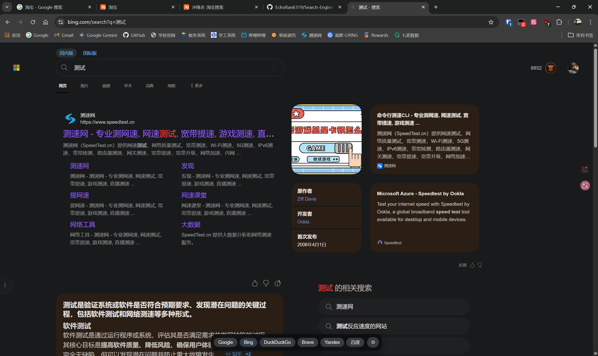
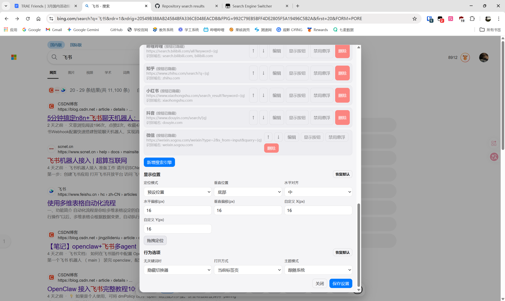

# Search Engine Switcher

[](https://greasyfork.org/zh-CN/scripts/570395-search-engine-switcher)
[](LICENSE)
[](https://www.tampermonkey.net/)

## 🚀 安装

### 方式一：Greasy Fork（推荐）

👉 [点击安装(中国大陆用户)](https://gf.qytechs.cn/zh-CN/scripts/570395-search-engine-switcher)👉 [点击安装](https://greasyfork.org/zh-CN/scripts/570395-search-engine-switcher)

### 方式二：手动安装

1. 安装脚本管理器：[Tampermonkey](https://www.tampermonkey.net/) 或 [Greasemonkey](https://addons.mozilla.org/firefox/addon/greasemonkey/)
2. 点击 [Search-Engine-Switcher.js](./Search-Engine-Switcher.js) → "Raw"
3. 脚本管理器会自动提示安装

## 📸 界面展示

<p align="center">
  
  
</p>
<p align="center">
  
  
</p>

## ✨ 功能特性

- ⚡ **快速切换** - 保留当前搜索词，一键切换搜索引擎
- 📱 **自适应滚动** - 大量引擎时自动横向滚动，支持触屏滑动和鼠标滚轮
- 🔧 **高度自定义** - 添加/删除/排序/隐藏搜索引擎
- 💾 **配置同步** - 支持导入导出 JSON 配置文件
- 🎨 **主题支持** - 跟随系统/浅色/深色模式
- 🖱️ **灵活打开** - 左键切换，中键强制新标签页打开
- 🎯 **智能显示** - 仅在搜索引擎页面显示，支持单站点禁用

### 支持的搜索引擎 (21+)

| 类型 | 搜索引擎 |
|------|----------|
| 传统搜索 | Google, Bing, 百度, DuckDuckGo, Brave, Yandex, 搜狗, 360搜索 |
| AI 大模型 | ChatGPT, Perplexity, Gemini, 千问, 豆包, DeepSeek, Kimi, 秘塔AI |
| 社交/社区 | YouTube, GitHub, 哔哩哔哩, 知乎, 小红书, 抖音, 微信 |


##  使用方法

### 基本操作

| 操作 | 说明 |
|------|------|
| 左键点击 | 切换搜索引擎 |
| 中键点击 | 强制在新标签页打开 |
| 长按/⚙️ | 打开设置面板 |

### 设置面板

- **引擎列表** - 管理搜索引擎：新增、删除、排序、显示/隐藏、启用/禁用悬浮
- **显示位置** - 预设位置或拖拽自定义
- **行为选项** - 主题模式、打开方式、无关键词时显示等

### 默认启用

Google, Bing, DuckDuckGo, Brave, Yandex, 百度

## 🛠️ 技术架构

```
Search-Engine-Switcher.js
├── 配置管理 (GM_getValue/GM_setValue)
├── 搜索引擎检测 (域名匹配)
├── 搜索词提取 (URL 参数解析)
├── UI 渲染 (注入式 CSS + 固定定位)
├── 事件处理 (点击/长按/拖拽)
└── 初始化
```

### 核心代码片段

**搜索引擎检测：**
```javascript
function activeEngineIdByHost() {
  const host = location.hostname;
  const exact = config.engines.find((e) =>
    (e.hosts || []).some((h) => isMatchHost(host, h))
  );
  return exact ? exact.id : '';
}
```

**搜索词提取：**
```javascript
function getCurrentQuery() {
  const url = new URL(location.href);
  for (const key of ['q', 'wd', 'word', 'query', 'text', 'keyword', 'search', 'p', 'k']) {
    const val = url.searchParams.get(key);
    if (val) return val.trim();
  }
  return '';
}
```

## 🌐 兼容性

- ✅ Chrome, Firefox, Edge, Safari
- ✅ Tampermonkey, Greasemonkey
- ✅ 响应式布局
- ✅ 浅色/深色主题

## 📜 更新日志

### v2.5.0
- 修复深色模式下激活按钮描边样式不一致的问题
- 优化主题切换逻辑，确保移动端正确应用

### v2.4.0
- 通义千问更名为「千问」，更新搜索地址至 `qianwen.com`
- 移除夸克预设（夸克/神马搜索均无 PC Web 搜索界面）
- 修复深色模式下激活按钮描边被 Dark Reader 篡改的问题
- 代码清理：移除冗余函数与死代码

### v2.3.0
- 新增配置导入导出功能

### v2.2.0
- 横向滚动优化，支持鼠标滚轮
- 新增离线使用指南

### v2.1.0
- 支持鼠标中键新标签页打开
- 单站点禁用悬浮功能

### v1.0.0
- 初始版本发布

## 🙏 特别感谢

灵感来源于 [Via 浏览器](https://viayoo.com/) 的搜索引擎切换功能。

## 📄 许可证

[MIT License](LICENSE)

## 🤝 贡献

欢迎提交 Issue 和 Pull Request！
